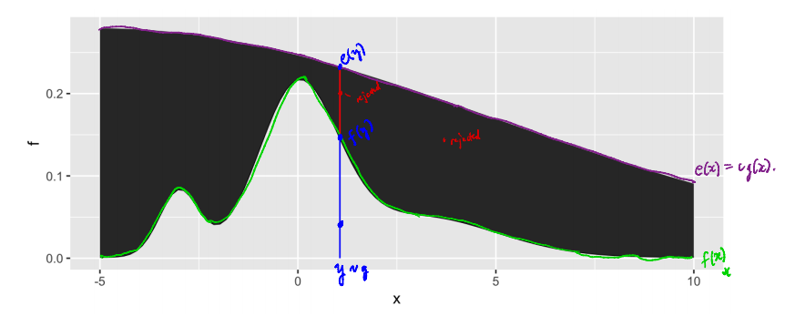

## Sampling

1. Would we be able to go over how to find the envelope for the accept reject method?

1. How to find the envelope value?

1. Concerning Accept-Reject: How can we be sure that our envelope function is greater than the function we are sampling from, for infinite support?

1. Can you talk more about choosing a constant to multiply by when using accept-reject and not using the uniform as an envelope function? I would like to see outliers where choosing a very large C and letting it run for longer would still not work (I know these situations exist).

1. Can you do an example of the accept reject method where you cannot use the uniform(0, 1) trick using the maximum and instead have to guess and check for the value of c for the envelope?

1. Can you review finding an envelope function in cases where the support is not 0 <= x <= 1? Is there a good, systematic way to go about finding an envelope if you don't immediately recognize the shape of the distribution or if you can't solve for the maximum?

1. For the accept reject ratio graph (image pasted): I know that y is g distributed, f(y) is just a point on the green f(x) curve, e(y) is just a point on the purple e(x) curve, and both y and x share the x-axis, but I don't understand what the red points are. Neither of them can be points on a density, can they? I know that g(x) is just another curve, but it doesn't look like the red dots are height values in the g(x) density. So what are the red points?

    

1. I have some practical questions regarding the accept-reject method and what you have previously stated about the support of the envelope encompassing the support of the pdf we're trying to sample from.

    a. In a lecture, you gave an example of a uniform(-10,10) distribution not being appropriate for a normal(0,2) distribution since the support for the normal distribution goes from -infinity to infinity while the uniform distribution goes from -10 to 10. However, if we for example consider dnorm(100,0,2), R rounds the pdf down to 0 anyway. Wouldn't it be the case then, that any time we use a normal pdf as an envelope, we are essentially truncating the distribution we are attempting to sample from (due to rounding)? 
    b. If this is the case wouldn't it be more realistic to use something like a uniform(-100,100) distribution (efficiency notwithstanding), where the pdf is calculated as nonzero for larger values as opposed to most distributions with infinite support?
    c. And if we were to use a uniform distribution in such a manner on the exam, would it be technically incorrect even if it produces a better approximation? 
    d. On a related note, I do not remember if this was mentioned in a lecture, but instead of using a single uniform distribution, can we use multiple (in a manner reminiscent of Riemann Sums) to improve efficiency?
    
1. In HW 5 when we took many samples, increased sample size, or did both, was the many samples part showing unbiasedness, and was the increased sample size part showing consistency?

1. If there is extra time can you go over how to sample from a discrete dsn? Page 4 on the Simulating notes, we skipped over how to do it the long way, but I am curious.

\newpage

## Monte Carlo Integration

1. Could we go over tips for finding g(x) and f(x) in monte carlo?

1. Can you go into more detail about the CLT's use in Monte Carlo integration, particularly why the R-calculated variance (i.e. var(sample)) of the Monte Carlo sample is different from the variance formula we used on our most recent homework?

1. Concerning Monte Carlo Integration: 
  
    a. Is the indicator method of Monte Carlo integration always best when we can't use the uniform distribution (because of an infinite support or whatever)?
    b. Is it valid to use transformation or accept-reject methods in order to sample from a density we are using in a Monte Carlo integral? Mainly I'm concerned about increased variance from the sampling making the estimated integral value less usable.
    c. I know it is okay to reuse the same samples (samples used in estimating the estimator) when estimating the variance of a Monte Carlo estimator, but is it equally okay to generate new samples?
    d. Slightly unrelated, is variance of the estimated variance a thing? Is variance of the estimated variance of the estimated variance a thing? Is this what moment generating functions do?

1. Can you review how to choose phi(x) in importance sampling? I know we have certain requirements for phi(x) for importance sampling to work but is there a good way to go about finding functions that work?

1. On page 18 in the importance sampling notes, it says "A rare draw from phi with much higher density under f than under phi will receive a huge weight and inflate the variance of the estimate". Would you be able to clarify this, perhaps using a visualization?

1. we could look into another example of importance sampling where the support goes to infinity, for some reason I have some trouble working with those, especially the derivation.

\newpage

## Other Questions

1. Will we ever have to prove why certain methods work or should we just know how to implement them?

