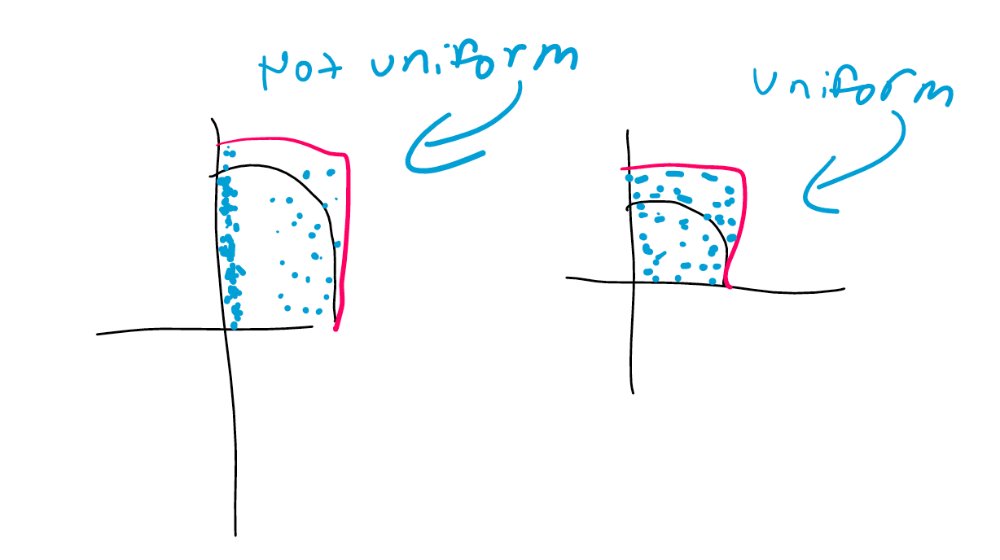

## Sampling

1. Are there specific characteristics we should look for in pdfs/cdfs that would help us choose which method to go about using? (Inverse transform, accept reject, ...) Can we maybe go through the most important concepts/rules that need to be met of each method.

1. For all these different types of simulating, what do real-life examples look like? Sometimes, I am confused about where we are relative to our world and how it relates to what we are doing.

1. Is it possible for us to go over getting the acceptance and rejects and how to envelop exceeds target? Also show us more examples of this?

1. Can you define "g" again for acceptance-reject (is there a way to choose it)?

1. How do you know how to “pick” an envelope without looking at a graph—to ensure that it covers the entire support and the tails?

1. The algorithm for transformation method at 3.1 I was wondering how to compute the G = g(X1,…., XP) drawn from g(X1,..., Xp).

1. For the method of the Transformation Methods(section 3), is it to "add on" something to the distribution of interest to "transform" it?

1. Can you give an example of what a distributions of weighted sums would be like (compared to weighted sums of distributions)?

1. Mixture distribution definition how to use the 2 sources of variability?

\newpage

## Monte Carlo Integration

1. I am a little confused about Chapter 6 page 9. Could you talk about how do you structure the linear transformation? Thanks!

1. For the review on Tuesday, the something I would like practice / clarification on are transformation methods

1. For Monte Carlo Integration for example 1.6 how to get about another approach when we want to use unif(0,1) instead of other method we were given?

1. How does Method 3 of the Monte Carlo integration example 1.7 (with the indicator function) work?

1. Is there a process for the best way to go about choosing a phi distribution or density for importance sampling?
What rules or results are we trying to meet with choosing a phi that is the "best"? Is there like an "ideal" or "best" phi that will have the lowest variance/most constant ratio, being technically the "right" phi to use?

1. Going over "Your Turn Importance Sampling Example" since we ran out of time in class.

1. My question for the review relates to importance sampling. In the class example, we biased the die by making 3 sides have value 1. However, this causes phi to not have positive probability everywhere f does, which violates one of the requirements stated later on. Is it okay to do this if the regions where f has positive probability and phi does not are not of interest to our estimation? Will we face this situation in the future or is it only a concern in our toy discrete example?

1. I think the one thing I am most confused about is why monte carlo integration still works, even if sampling points does not follow a uniform distribution (for integrating on an interval from a to b). In the notes, it states that the only requirement is that the points are randomly drawn from a distribution with support over the range of integration. It seems like if the distribution we are drawing from is not uniform, then some parts of the curve would be under sampled, and other parts of the curve would be over sampled. I attached a picture to help explain

    

    In the picture, if we are integrating -x^2 + 4 (from 0 to 2), and the point of monte carlo is to get the ratio of: ( dots inside the curve / total dots) * area of distribution (in pink), it seems like this would be affected by the type of distribution we are taking our samples from.

    Does this not matter because we are taking enough samples?

\newpage

## Other Questions

1. Does convergence almost surely include both convergence in probability and convergence in distribution? Or is there no overlap with those three?

