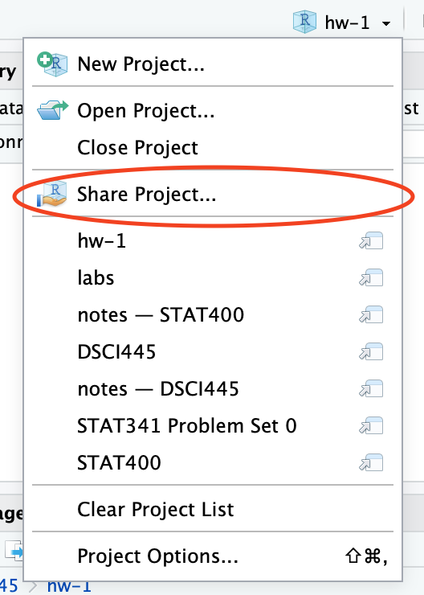

# hw-1

Homework 1 in STAT400: Computational Statistics @ CSU

## Assignment

The diamonds data set is part of the `ggplot2` package. You can access it via the following code


``` r
# you might need to install the ggplot2 package first
# install.packages("ggplot2")

# load the ggplot2 library
library(ggplot2)

data(diamonds)
head(diamonds) 

# ---------------------------------------------
# use help to get more information on the data
help(diamonds)
```

This week, we are going to investigate the `diamonds` data set a bit. In particular, we are interested in the data quality.

Write a short report describing problems with the diamonds data. The report is supposed to be written entirely in `R`, i.e. you should be able to copy and paste your report into `R` and run it to get the results (and this is what we will do for the grading).

Use the skills you have learned in class to find interesting subsets and graphics which reveal problems with the data. To find problems you will need to use your common sense, and your knowledge of the data. Start by looking for unusual diamonds on each variable individually, and then on combinations of the variables. You might want to create new variables. 

Create graphical summaries of the data using what we've learned in class and `ggplot2` and describe your findings. 

Turn in in a pdf of your analysis to canvas. For this first assignment you can paste plots into a word/google docs document and add you commentary (if you have already had experience, please feel free to use Rmarkdown or LaTeX instead). Your script on the server will also be used in grading, so be sure they are identical.

**Be sure to share your server project with the instructor and grader:**

1. Open your "homeworks" project on liberator.stat.colostate.edu
2. Click the drop down on the project (top right side) > Share Project...
    
    <div class="figure">
    
    <p class="caption">plot of chunk unnamed-chunk-2</p>
    </div>
  
3. Click the drop down and add "stat400instructors" to your project.

    <div class="figure">
    
    <p class="caption">plot of chunk unnamed-chunk-3</p>
    </div>

This is how you **receive points** for reproducibility on your homework!
