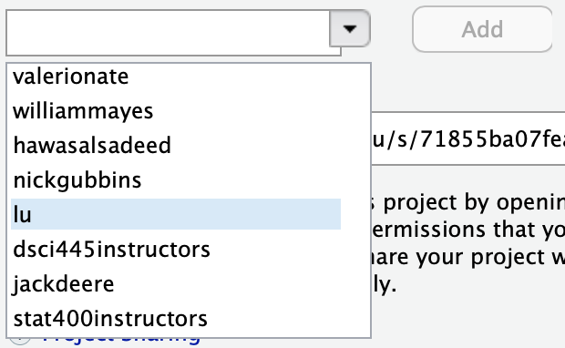

# hw-2

Homework 2 in STAT400: Computational Statistics @ CSU

## Assignment

The City of Fort Collins maintains a web portal to host data sets that are available to the public in a format that citizens can easily search, filter, and utilize (https://www.fcgov.com/opendata/). In particular, they have released the earnings of city employees from 2010-2018.

Each of these data sets are included in this repo under the `data/` folder.

1. Write a function that will take a year (2010-2018) as an input parameter and do the following:
    - Load the corresponding CSV into `R` (i.e. "data/[year]_Fort_Collins_City_Employee_Earnings.csv", see `paste()`).
    - Extract the `Job Title`, `Department` and `Earnings` columns.
    - Change the column names to `job_title`, `department`, and `earnings`.
    - Make `job_title` and `department` values lower case (see `tolower()` and `mutate_at()`).
    - Add a column called `year` with the appropriate year.
2. Apply your function to all years available of the city employees data (2010-2018) and store your results in a single data frame (see `rbind` for binding rows of data frames together).
3. For those departments that have over 25 unique job titles, make a plot that depicts earnings over time by department in the city of Fort Collins.

Turn in in a pdf of your homework to canvas. Your .Rmd file on the server will also be used in grading, so be sure they are identical and reproducible.

**Be sure to share your server project with the instructor and grader:**

1. Open your hw-1 project on liberator.stat.colostate.edu
2. Click the drop down on the project (top right side) > Share Project...
    
    ```{r, echo=FALSE, out.width="25%"}
    knitr::include_graphics("share_project.png")
    ```
  
3. Click the drop down and add "stat400instructors" to your project.

    ```{r, echo=FALSE, out.width="25%"}
    
    ```

This is how you **receive points** for reproducibility on your homework!