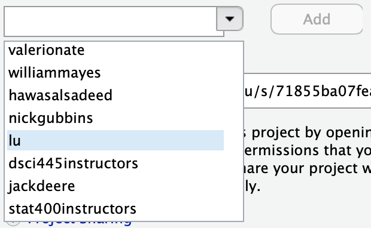

# hw-4

Homework 4 in STAT400: Computational Statistics @ CSU

## Assignment

Be sure to `set.seed(400)` at the beginning of your homework.

1. The Pareto$(a, b)$ distribution has the cdf
    $$
    F(x) = 1 - \left(\frac{b}{x}\right)^a, \qquad x \ge b > 0, a > 0.
    $$
    Derive the probability integral transformation $F^{-1}(U)$ and use the inverse transform method to simulate a random sample of size $1000$ from the Pareto$(2, 2)$ distribution. Graph the density histogram of the sample with the Pareto$(2, 2)$ density super-imposed for comparison.
    
2. The Rayleigh density is defined as
    $$
    f(x) = \frac{x}{\sigma^2}e^{-x^2/2\sigma^2}, \qquad x \ge 0, \sigma > 0.
    $$
    Write an accept-reject algorithm to generate random samples from a Rayleigh$(\sigma)$ distribution. Generate $1000$ samples for several choices of $\sigma > 0$ ($\sigma = 1, 2$) and graph the density histogram of each sample with the corresponding Rayleigh density super-imposed for comparison. Check the mode of the generated samples is close to the theoretical mode $\sigma$.
    
3. A discrete random variable has pmf
    ```{r, echo = FALSE}
    knitr::kable(t(data.frame(x = 0:4, f = c(.1, .2, .2, .2, .3))))
    ```
    Use the inverse transform method to generate a random sample of size $1000$ from the distribution of $X$. Construct a relative frequency table and compare the empirical with the theoretical probabilities. Repeat using the `R` `sample` function.

4. For the accept-reject example (Simulating notes Example 2.1, pg. 7-8) do the following:

    a. Create a table comparing the $0.1, 0.2, \dots, 0.9$ quantiles (see `quantile`) for the algorithm when you generate $100$, $1000$, and $10,000$ samples. Compare your results to the theoretical quantiles from a Beta(4,3) distribution (see `qbeta`). What happens as the number of samples increases?
    b. Add a counter to the original algorithm to determine the number of iterations that were needed to generate 1000 samples. Run your algorithm 10 times ("trials"). Make a table showing the number of iterations required for each trial and the mean number of iterations required for all 10 trials. Compute the proportion of accepted samples for each trial. Compare the mean proportion accepted to the expected proportion.
    
Turn in in a pdf of your homework to canvas. Your .Rmd file on the server will also be used in grading, so be sure they are identical and reproducible.

**Be sure to share your server project with the instructor and grader:**

1. Open your hw-1 project on liberator.stat.colostate.edu
2. Click the drop down on the project (top right side) > Share Project...
    
    ```{r, echo=FALSE, out.width="25%"}
    knitr::include_graphics("share_project.png")
    ```
  
3. Click the drop down and add "stat400instructors" to your project.

    ```{r, echo=FALSE, out.width="25%"}
    
    ```

This is how you **receive points** for reproducibility on your homework!