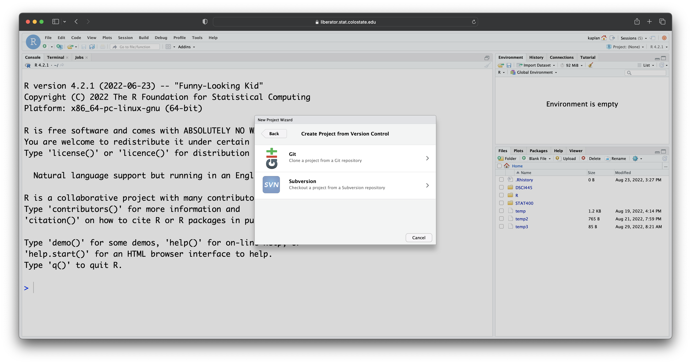

```{r echo = FALSE, message = FALSE}
knitr::opts_chunk$set(fig.height = 3)
```

We will start the class with some tools that will be useful for success in this class. Going forward, we will use these tools for any [computing]{.red} and [data analysis]{.red} tasks.

<br />
<br />
<br />


<br />
<br />
<br />

In STAT400, we will cover each part of the data analysis pipeline using

1. Tools like `R` and RStudio

2. Packages in `R`

3. Computational ideas in Statistics (implemented in `R`)

# `R`

`R` (https://www.r-project.org) is a free, open source software environment for statistical computing and graphics that is available for every major platform. 

RStudio (https://rstudio.com) is an integrated development environment (IDE) for `R`. It is also free, open source, and available for every major platform. It makes data analysis and projects in `R` go a bit smoother.

## Getting Started

We can use `R` like an overgrown calculator.

```{r}
# simple math
5*(10 - 4) + 44

# integer division
7 %/% 2

# modulo operator (Remainder)
7 %% 2

# powers
1.5^3
```

<br />

We can use mathematical functions.

```{r}
# exponentiation
exp(1)

# logarithms
log(100)
log(100, base = 10)

# trigonometric functions
sin(pi/2)
cos(pi)
asin(1)
```

<br />
<br />

We can create variables using the assignment operator `<-`,

```{r}
# create some variables
x <- 5
class <- 400
hello <- "world"
```

and then use those variables in our functions.

```{r}
# functions of variables
log(x)
class^2
```

There are some rules for variable naming.

Variable names --

1. Can't start with a number.

2. Are case-sensitive.

3. Can be the name of a predefined internal function or letter in `R` (e.g., c, q, t, C, D, F, T, I). Try [not]{.red} to use these.

4. Cannot be reserved words that `R` (e.g., for, in, while, if, else, repeat, break, next).

## Vectors

Variables can store more than one value, called a *vector*. We can create vectors using the combine (`c()`) function.

```{r}
# store a vector
y <- c(1, 2, 6, 10, 17)
```

When we perform functions on our vector, the result is elementwise.

```{r}
# elementwise function
y/2
```

A vector must contain all values of the same type (i.e., numeric, integer, character, etc.).

We can also make sequences of numbers using either `:` or `seq()`.

```{r}
# sequences
a <- 1:5
a
b <- seq(1, 5, by = 1)
b
```

[ ]{.pagebreak}

[**Your Turn**]{.yourturn}

1. Use the `rep()` function to construct the following vector: `1 1 2 2 3 3 4 4 5 5`

2. Use `rep()` to construct this vector: `1 2 3 4 5 1 2 3 4 5 1 2 3 4 5`

[ ]{.pagebreak}

We can **extract** values by index.

```{r}
a[3]
```

Indexing is pretty powerful.

```{r}
# indexing multiple items
a[c(1, 3, 5)]
a[1:3]
```

We can even tell `R` which elements we don't want.

```{r}
a[-3]
```

And we can index by **logical** values. `R` has logicals built in using `TRUE` and `FALSE` (`T` and `F` also work, but can be overwritten). Logicals can result from a comparison using

- `<` : "less than"
- `>` : "greater than"
- `<=` : "less than or equal to"
- `>=` : "greater than or equal to"
- `==` : "is equal to"
- `!=` : "not equal to"

```{r}
# indexing by vectors of logicals
a[c(TRUE, TRUE, FALSE, FALSE, FALSE)]

# indexing by calculated logicals
a < 3
a[a < 3]
```

[ ]{.pagebreak}

[**Your Turn**]{.yourturn}

1. Create a vector of 1300 values evenly spaced between 1 and 100.

2. How many of these values are greater than 91? (Hint: see `sum()` as a helpful function.)

[ ]{.pagebreak}

We can combine elementwise logical vectors in the following way:

- `&` : elementwise AND
- `|` : elementwise OR

```{r}
c(TRUE, TRUE, FALSE) | c(FALSE, TRUE, FALSE)
c(TRUE, TRUE, FALSE) & c(FALSE, TRUE, FALSE)
```


There are two more useful functions for looking at the start (head) and end (tail) of a vector.

```{r}
head(a, 2)
tail(a, 2)
```

We can also modify elements in a vector.

```{r}
a[1] <- 0
a[c(4, 5)] <- 100
a
```

[ ]{.pagebreak}

[**Your Turn**]{.yourturn}

Using the vector you created of 1300 values evenly spaced between 1 and 100,

1. Modify the elements greater than 90 to equal 9999.

2. View (not modify) the first 10 values in your vector.

3. View (not modify) the last 10 values in your vector.

[ ]{.pagebreak}

As mentioned, elements of a vector must all be the same type. So, changing an element of a vector to a different type will result in all elements being converted to the *most general* type.

```{r}
a
a[1] <- ":-("
a
```

By changing a value to a string, all the other values were also changed.

There are many data types in `R`, numeric, integer, character (i.e., string), Date, and factor being the most common. We can convert between different types using the `as` series of functions.

```{r}
as.character(b)
```

There are a whole variety of useful functions to operate on vectors. A couple of the more common ones are `length`, which returns the length (number of elements) of a vector, and `sum`, which adds up all the elements of a vector.

```{r}
n <- length(b)
n
sum_b <- sum(b)
sum_b
```

We can then create some statistics!

```{r}
mean_b <- sum_b/n
sd_b <- sqrt(sum((b - mean_b)^2)/(n - 1))
```

But, we don't have to.

```{r}
mean(b)
sd(b)
summary(b)
quantile(b, c(.25, .75))
```

## Data Frames

Data frames are the data structure you will (probably) use the most in `R`. You can think of a data frame as any sort of rectangular data. It is easy to conceptualize as a table, where each column is a vector. Recall, each vector must have the same data type *within* the vector (column), but columns in a data frame need not be of the same type. Let's look at an example!

```{r}
# look at top 6 rows
head(iris)

# structure of the object
str(iris)
```

This is Anderson's Iris data set (https://en.wikipedia.org/wiki/Iris_flower_data_set), available by default in `R`.

Some facts about data frames:

- Structured by rows and columns and can be indexed
- Each column is a variable of one type
- Column names or locations can be used to index a variable
- Advice for naming variables applys to naming columns
- Can be specified by grouping vectors of equal length as columns

Data frames are indexed (similarly to vectors) with `[ ]`. 

- `df[i, j]` will select the element of the data frame in the `i`th row and the `j`th column.
- `df[i, ]` will select the entire `i`th row as a data frame
- `df[ , j]` will select the entire `j`th column as a vector

We can use logicals or vectors to index as well.

```{r}
iris[1, ]
iris[, 1]
iris[1, 1]
```

We can also select columns by name in two ways.

```{r}
iris$Species
iris[, "Species"]
```

To add columns, create a new vector that is the same length as other columns. We can append new column to the data frame using the `$` operator or the `[]` operators.

```{r}
# make a copy of iris
my_iris <- iris

# add a column
my_iris$sepal_len_square <- my_iris$Sepal.Length^2  
head(my_iris)
```

It's quite easy to subset a data frame.

```{r}
my_iris[my_iris$sepal_len_square < 20, ]
```

We'll see another way to do this in Section \@ref(tidyverse).

We can create new data frames using the `data.frame()` function,

```{r}
df <- data.frame(NUMS = 1:5, 
                 lets = letters[1:5],
                 cols = c("green", "gold", "gold", "gold", "green"))
```

and we can change column names using the `names()` function.

```{r}
names(df)
names(df)[1] <- "nums"

df
```

[ ]{.pagebreak}

[**Your Turn**]{.yourturn}

1. Make a data frame with column 1: `1,2,3,4,5,6` and column 2: `a,b,a,b,a,b`

2. Select only rows with value "a" in column 2 using logical vector

3. `mtcars` is a built-in data set like `iris`: Extract the 4th row of the `mtcars` data.

[ ]{.pagebreak}

There are other data structures available to you in `R`, namely lists and matrices. We will not cover these in the notes, but I encourage you to read more about them (https://faculty.nps.edu/sebuttre/home/R/lists.html and https://faculty.nps.edu/sebuttre/home/R/matrices.html).

## Basic Programming

We will cover three basic programming ideas: functions, conditionals, and loops.

### Functions

We have used many functions that are already built into `R` already. For example -- `exp()`, `log()`, `sin()`, `rep()`, `seq()`, `head()`, `tail()`, etc.

But what if we want to use a function that doesn't exist?

**We can write it!**

Idea: We want to avoid repetitive coding because errors will creep in.
Solution: Extract common core of the code, wrap it in a function, and make it reusable.

The basic structure for writing a function is as follows:

- Name
- Input arguments (including names and default values)
- Body (code)
- Output values

```{r}
# we store a function in a named value
# function is itself a function to create functions!
# we specify the inputs that we can use inside the function
# we can specify default values, but it is not necessary
name <- function(input = FALSE) {
  # body code goes here
  
  # return output vaues
  return(input)
}
```

Here is a more realistic first example:

```{r}
my_mean <- function(x) {
  sum(x)/length(x)
}
```

Let's test it out.

```{r}
my_mean(1:15)
my_mean(c(1:15, NA))
```

Some advice for function writing:

1. Start simple, then extend. 
2. Test out each step of the way. 
3. Don’t try too much at once.

### Conditionals

Conditionals are functions that control the flow of analysis. Conditionals determine if a specified condition is met (or not), then direct subsequent analysis or action depending on whether the condition is met (or not).

```{r eval=FALSE}
if(condition) {
  # Some code that runs if condition is TRUE
} else {
  # Some code that runs if condition is TRUE
}
```

- `condition` is a length one logical value, i.e. either `TRUE` or `FALSE`
- We can use `&` and `|` to combine several conditions 
- `!` negates condition

For example, if we wanted to do something with `na.rm` from our function,

```{r eval=FALSE}
if(na.rm) x <- na.omit(x) # na.omit is a function that removes NA values
```

might be a good option.

### Loops

Loops (and their cousins the `apply()` function) are useful when we want to repeat the same block of code many times. Reducing the amount of typing we do can be nice, and if we have a lot of code that is essentially the same we can take advantage of looping. `R` offers several loops: for, while, repeat.

For loops will run through a specified index and perform a set of code for each value of the indexing variable.

```{r eval=FALSE}
for(i in index values) {
  # block of code
  # can print values also
  # code in here will most likely depend on i
}
```

```{r}
for(i in 1:3) {
  print(i)
}
```

```{r}
for(species in unique(iris$Species)) {
  subset_iris <- iris[iris$Species == species,]
  avg <- mean(subset_iris$Sepal.Length)
  print(paste(species, avg))
}
```

While loops will run until a specified condition is no longer true.

```{r}
condition <- TRUE
while(condition) {
  # do stuff
  # don't forget to eventually set the condition to false
  # in the toy example below I check if the current seconds is divisible by 5
  time <- Sys.time()
  if(as.numeric(format(time, format = "%S")) %% 5 == 0) condition <- FALSE
}
print(time)
```

```{r}
# we can also use while loops to iterate
i <- 1
while (i <= 5) {
    print(i)
    i <- i + 1
}
```

[ ]{.pagebreak}

[**Your Turn**]{.yourturn}

1. Alter your `my_mean()` function to take a second argument (`na.rm`) with default value `FALSE` that removes `NA` values if `TRUE`.

2. Add checks to your function to make sure the input data is either numeric or logical. If it is logical convert it to numeric (Hint: look at the `stopifnot()` function).

3. The diamonds data set is included in the `ggplot2` package (not by default in `R`). It can be read into your environment with the following function.

    ```{r}
    data("diamonds", package = "ggplot2")
    ```

    Loop over the columns of the diamonds data set and apply your mean function to all of the numeric columns (Hint: look at the `class()` function).

[ ]{.pagebreak}


## Packages

Commonly used `R` functions are installed with base `R`.

`R` packages containing more specialized `R` functions can be installed freely from CRAN servers using function `install.packages()`.

After packages are installed, their functions can be loaded into the current `R` session using the function `library()`.

Packages are contrbuted by `R` users just like you! 

We will use some great packages in this class. Feel free to venture out and find your favorites (google R package + what you're trying to do to find more packages).

## Additional resources

You can get help with `R` functions within `R` by using the `help()` function, or typing `?` before a function name.

Stackoverflow can be helpful -- if you have a question, maybe somebody else has already asked it (https://stackoverflow.com/questions/tagged/r).

R Reference Card (https://cran.r-project.org/doc/contrib/Short-refcard.pdf)

Useful Cheatsheets (https://www.rstudio.com/resources/cheatsheets/)

R for Data Science (https://r4ds.had.co.nz)

Advanced R (https://adv-r.hadley.nz)

# ggplot2

We will be using the `ggplot2` package for making graphics in this class.

The first time on your machine you’ll need to install the package:

```{r eval = FALSE}
install.packages("ggplot2")
```

Whenever you first want to plot during an `R` session, we need to load the library. 

```{r}
library(ggplot2)
```

## Why visualize?

The sole purpose of visualization is communication. Visualization offers an alternative way of communicating numbers than simply using tables. Often, we can get more information out of our numbers graphically than with numerical summaries alone. Through the use of [exploratory data analysis]{.red}, we can see what the data can tell us beyond the formal modeling or hypothesis testing task.

For example, let's look at the following dataset.

```{r}
anscombe
```

Anscombe's Quartet is comprised of 4 datasets that have nearly identical simple statistical properties. Each dataset contains 11 (x, y) points with the same mean, median, standard deviation, and correlation coefficient between x and y.

```{r, echo=FALSE, message = FALSE, warning = FALSE}
library(dplyr)
library(tidyr)

anscombe %>%
  gather(variable, value) %>%
  separate(variable, into = c("variable", "dataset"), sep = 1) %>%
  group_by(variable, dataset) %>%
  mutate(id = 1:n()) %>%
  spread(variable, value) %>%
  group_by(dataset) %>%
  summarise(mean_x = mean(x), sd_x = sd(x),
            mean_y = mean(y), sd_y = sd(y),
            cor = cor(x, y)) %>%
  knitr::kable()
```

But this doesn't tell the whole story. Let's look closer at these datasets.

```{r, echo=FALSE}
anscombe %>%
  gather(variable, value) %>%
  separate(variable, into = c("variable", "dataset"), sep = 1) %>%
  group_by(variable, dataset) %>%
  mutate(id = 1:n()) %>%
  spread(variable, value) %>%
  ggplot() +
  geom_point(aes(x, y)) +
  geom_smooth(aes(x, y), method = "lm", se = FALSE) +
  facet_wrap(.~dataset)
```

Visualizations can aid communication and make the data easier to perceive. It can also show us things about our data that numerical summaries won't necessarily capture.

## A Grammar of Graphics

The grammar of graphics was developed by Leland Wilkinson (https://www.springer.com/gp/book/9780387245447). It is a set of grammatical rules for creating perceivable graphs. Rather than thinking about a limited set of graphs, we can think about graphical forms. This abstraction makes thinking, creating, and communicating graphics easier.

Statistical graphic specifications are expressed using the following components.

1. **data**: a set of data operations that create variables from datasets
2. **trans**: variable transformations
3. **scale**: scale transformations
4. **coord**: a coordinate system
5. **element**: graphs (points) and their aesthetic attributes (color)
6. **guide**: one or more guides (axes, legends, etc.)

`ggplot2` is a package written by Hadley Wickham (https://vita.had.co.nz/papers/layered-grammar.html) that implements the ideas in the grammar of graphics to create layered plots.

`ggplot2` uses the idea that you can build every graph with graphical components from three sources

1. the data, represented by `geom`s
2. the scales and coordinate system
3. the plot annotations 

This works by mapping values in the data to visual properties of the geom (aesthetics) like size, color, and locations.

Let's build a graphic. We start with the data. We will use the `diamonds` dataset, and we want to explore the relationship between carat and price.

```{r}
head(diamonds)
ggplot(data = diamonds)
```

Next we need to specify the aesthetic (variable) mappings.

```{r}
ggplot(data = diamonds, mapping = aes(carat, price))
```

Now we choose a geom to display our data.

```{r}
ggplot(data = diamonds, mapping = aes(carat, price)) +
  geom_point()
```

And add an aesthetic to our plot.

```{r}
ggplot(data = diamonds, mapping = aes(carat, price)) +
  geom_point(aes(color = cut))
```

We could add another layer.

```{r}
ggplot(data = diamonds, mapping = aes(carat, price)) +
  geom_point(aes(color = cut)) +
  geom_smooth(aes(color = cut), method = "lm")
```

And finally, we can specify coordinate transformations.

```{r}
ggplot(data = diamonds, mapping = aes(carat, price)) +
  geom_point(aes(color = cut)) +
  geom_smooth(aes(color = cut), method = "lm") +
  scale_y_sqrt()
  
```

Notice we can add on to our plot in a layered fashion.

## Graphical Summaries

There are some basic charts we will use in this class that cover a wide range of cases. For univariate data, we can use dotplots, histograms, and barcharts. For two dimensional data, we can look at scatterplots and boxplots.

### Scatterplots

Scatterplots are used for investigating relationships between two numeric variables. To demonstrate some of the flexibility of scatterplots in `ggplot2`, let's answer the following question.

> Do cars with big engines use more fuel than cars with small engines?

We will use the `mpg` dataset in the `ggplot2` package to answer the question. This dataset contains observations collected by the US Environmental Protection Agency on `r length(unique(mpg$model))` models of car.

```{r}
dim(mpg)
summary(mpg)
head(mpg)
```

`mpg` contains the following variables: `displ`, a car’s engine size, in liters, and `hwy`, a car’s fuel efficiency on the highway, in miles per gallon (mpg).

```{r}
ggplot(data = mpg) +
  geom_point(mapping = aes(displ, hwy))
```

So we can say, yes, cars with larger engines have worse fuel efficiency. But there is more going on here.

```{r echo = FALSE}
mpg %>%
  mutate(outlier = displ > 5 & hwy > 20) %>%
  ggplot() +
  geom_point(mapping = aes(displ, hwy, colour = outlier, size = outlier)) +
  scale_color_manual(values = c("black", "red")) +
  scale_size_manual(values = 1:2) +
  theme(legend.position = "none")


```

The red points above seem to have higher `mpg` than they should based on engine size alone (outliers). Maybe there is a confounding variable we've missed. The `class` variable of the mpg dataset classifies cars into groups such as compact, midsize, and SUV.

```{r}
ggplot(data = mpg) +
  geom_point(mapping = aes(displ, hwy, colour = class))
```

The colors show that many of the unusual points are two-seater cars, probably sports cars! Sports cars have large engines like SUVs and pickup trucks, but small bodies like midsize and compact cars, which improves their gas mileage.

Instead of color, we could also map a categorical variable (like `class`) to shape, size, and transparency (`alpha`).

So far we have mapped aesthetics to variables in our dataset. What happens if we just want to generally change the aesthetics of our plots, without tying that to data? We can specify general aesthetics as parameters of the `geom`, instead of specifying them as aesthetics (`aes`).

```{r}
ggplot(data = mpg) +
  geom_point(mapping = aes(displ, hwy), colour = "darkgreen", size = 2)
```

When interpreting a scatterplot we can look for big patterns in our data, as well as form, direction, and strength of relationships. Additionally, we can see small patterns and deviations from those patterns (outliers).

[ ]{.pagebreak}

[**Your Turn**]{.yourturn}

1. Make a scatterplot of `cty` vs. `hwy` mpg using the `mpg` dataset.

2. Describe the relationship that you see.

3. Map color and shape to type of drive the car is (see `?mpg` for details on the variables.). Do you see any patterns?

4. Alter your plot from part 3. to make all the points be larger.

[ ]{.pagebreak}


### Histograms, Barcharts, and Boxplots

We can look at the distribution of continuous variables using **histograms** and **boxplots** and the distribution of discrete variables using **barcharts**.

```{r}
ggplot(data = mpg) +
  geom_histogram(mapping = aes(hwy), bins = 30) 
## histograms will look very different sometimes with different binwidths

ggplot(data = mpg) +
  geom_boxplot(mapping = aes(drv, hwy)) 
## boxplots allow us to see the distribution of a cts rv conditional on a discrete one
## we can also show the actual data at the same time
ggplot(data = mpg) +
  geom_boxplot(mapping = aes(drv, hwy)) +
  geom_jitter(mapping = aes(drv, hwy), alpha = .5)

ggplot(data = mpg) +
  geom_bar(mapping = aes(drv)) 
## shows us the distribution of a categorical variable
```

### Facets

So far we've looked at 

1. how one (or more) variables are distributed - barchart or histogram
2. how two variables are related - scatterplot, boxplot
3. how two variables are related, conditioned on other variables - color

Sometimes color isn't enough to show conditioning because of crowded plots.

```{r}
ggplot(data = diamonds, mapping = aes(carat, price)) +
  geom_point(aes(color = cut))
```

When this is the case, we can *facet* to display plots for different subsets. To do this, we specify row variables ~ column variables (or . for none).

```{r}
ggplot(data = diamonds, mapping = aes(carat, price)) +
  geom_point(aes(color = cut)) +
  facet_wrap(. ~ cut)
```

If instead we have two variables we want to facet by, we can use `facet_grid()`.

```{r, fig.height=6}
ggplot(data = diamonds, mapping = aes(carat, price)) +
  geom_point(aes(color = cut)) +
  facet_grid(color ~ cut)
```

[ ]{.pagebreak}

[**Your Turn**]{.yourturn}

Using the `mpg` dataset,

1. Make a histogram of `hwy`, faceted by `drv`.

2. Make a scatterplot that incorporates color, shape, size, and facets.

3. BONUS - Color your histograms from 1. by `cyl`. Did this do what you thought it would? (Look at `fill` and `group` as options instead).

[ ]{.pagebreak}

## Additional resources

Documentation and cheat sheets (https://ggplot2.tidyverse.org)

Book website (http://had.co.nz/ggplot2/)

Ch. 3 of R4DS (https://r4ds.had.co.nz/data-visualisation.html)

# tidyverse

The tidyverse is a suite of packages released by RStudio that work very well together ("verse") to make data analysis run smoothly ("tidy"). It's also a package in `R` that loads all the packages in the tidyverse at once.

```{r, eval=FALSE}
library(tidyverse)
```

You actually already know one member of the tidyverse -- `ggplot2`! We will highlight three more packages in the tidyverse for data analysis.


## `readr`

The first step in (almost) any data analysis task is reading data into `R`. Data can take many formats, but we will focus on text files.

> But what about `.xlsx`??

File extensions `.xls` and `.xlsx` are proprietary Excel formats/ These are binary files (meaning if you open one outside of Excel it will not be human readable). An alternable for rectangular data is a `.csv`.

`.csv` is an extension for *comma separated value* files. They are text files -- directly readable -- where each column is separated by a comma and each row a new line.

```
Rank,Major_code,Major,Total,Men,Women,Major_category,ShareWomen
1,2419,PETROLEUM ENGINEERING,2339,2057,282,Engineering,0.120564344
2,2416,MINING AND MINERAL ENGINEERING,756,679,77,Engineering,0.101851852
```

`.tsv` is an extension for *tab separated value* files. These are also text files, but the columns are separated by tabs instead of commas. Sometimes these will be `.txt` extension files.

```
Rank    Major_code    Major    Total    Men    Women    Major_category    ShareWomen
1    2419    PETROLEUM ENGINEERING    2339    2057    282    Engineering    0.120564344
2    2416    MINING AND MINERAL ENGINEERING    756    679    77    Engineering    0.101851852
```

The package `readr` provides a fast and friendly way to ready rectangular text data into `R`.

Here is an example csv file from fivethirtyeight.com on how to choose your college major (https://fivethirtyeight.com/features/the-economic-guide-to-picking-a-college-major/).

```{r}
# load readr
library(readr)

# read a csv
recent_grads <- read_csv(file = "https://raw.githubusercontent.com/fivethirtyeight/data/master/college-majors/recent-grads.csv")
```

`read_csv()` is just one way to read a file using the `readr` package.

- `read_delim()`: the most generic function. Use the delim argument to read a file with any type of delimiter
- `read_tsv()`: read tab separated files
- `read_lines()`: read a file into a vector that has one element per line of the file
- `read_file()`: read a file into a single character element
- `read_table()`: read a file separated by space

[ ]{.pagebreak}

[**Your Turn**]{.yourturn}


1. Read the NFL salaries dataset from https://raw.githubusercontent.com/ada-lovecraft/ProcessingSketches/master/Bits%20and%20Pieces/Football_Stuff/data/nfl-salaries.tsv into `R`. 

2. What is the highest NFL salary in this dataset? Who is the highest paid player?

3. Make a histogram and describe the distribution of NFL salaries.

[ ]{.pagebreak}

## `dplyr`

We almost never will read in data and have it in exactly the right form for visualizing and modeling. Often we need to create variable or summaries.

To facilitate easy transformation of data, we're going to learn how to use the `dplyr` package. `dplyr` uses 6 main verbs, which correspond to some main tasks we may want to perform in an analysis. 

We will do this with the `recent_grads` data from fivethiryeight.com we just read into `R` using `readr`.

### `%>%`

Before we get into the verbs in `dplyr`, I want to introduce a new paradigm. All of the functions in the tidyverse are structured such that the first argument is a data frame and they also return a data frame. This allows for efficient use of the pipe operator `%>%` (pronounce this as "then").

```{r, eval=FALSE}
a %>% b()
```

Taked the result on the left and passes it to the first argument on the right. This is equivalent to

```{r, eval=FALSE}
b(a)
```

This is useful when we want to chain together many operations in an analysis.

### `filter()`

`filter()` lets us subset observations based on their values. This is similar to using `[]` to subset a data frame, but simpler.

The first argument is the name of the data frame. The second and subsequent arguments are the expressions that filter the data frame. 

Let's subset the `recent_grad` data set to focus on Statistics majors.

```{r}
recent_grads %>% filter(Major == "STATISTICS AND DECISION SCIENCE")
```

Alternatively, we could look at all Majors in the same category, "Computers & Mathematics", for comparison.

```{r}
recent_grads %>% filter(Major_category == "Computers & Mathematics")
```

Notice we are using `%>%` to pass the data frame to the first argument in `filter()` and we do not need to use `recent_grads$Colum Name` to subset our data.

`dplyr` functions never modify their inputs, so if we need to save the result, we have to do it using `<-`.

```{r}
math_grads <- recent_grads %>% filter(Major_category == "Computers & Mathematics")
```

Everything we've already learned about logicals and comparisons comes in handy here, since the second argument of `filter()` is a comparitor expression telling `dplyr` what rows we care about.

### `arrange()`

`arrange()` works similarly to `filter()` except that it changes the order of rows rather than subsetting. Again, the first parameter is a data frame and the additional parameters are a set of column names to order by. 

```{r}
math_grads %>% arrange(ShareWomen)
```

If we provide more than one column name, each additional column will be used to break ties in the values of preceding columns.

We can use `desc()` to re-order by a column in descending order.

```{r}
math_grads %>% arrange(desc(ShareWomen))
```

### `select()`

Sometimes we have data sets with a ton of variables and often we want to narrow down the ones that we actually care about. `select()` allows us to do this based on the names of the variables.

```{r}
math_grads %>% select(Major, ShareWomen, Total, Full_time, P75th)
```

We can also use 

- `:` to select all columns between two columns
- `-` to select all columns except those specified
- `starts_with("abc")` matches names that begin with "abc"
- `ends_with("xyz")` matches names that end with "xyz"
- `contains("ijk")` matches names that contain "ijk"
- `everything()` mathes all columns

```{r}
math_grads %>% select(Major, College_jobs:Low_wage_jobs)
```

`rename()` is a function that will rename an existing column and select all columns.

```{r}
math_grads %>% rename(Code_major = Major_code)
```

### `mutate()`

Besides selecting sets of existing columns, we can also add new columns that are functions of existing columns with `mutate()`. `mutate()` always adds new columns at the end of the data frame.

```{r}
math_grads %>% mutate(Full_time_rate = Full_time_year_round/Total)

# we can't see everything
math_grads %>% 
  mutate(Full_time_rate = Full_time_year_round/Total) %>% 
  select(Major, ShareWomen, Full_time_rate)
```

### `summarise()`

The last major verb is summarise(). It collapses a data frame to a single row based on a summary function.

```{r}
math_grads %>% summarise(mean_major_size = mean(Total))
```

A useful summary function is a count (`n()`), or a count of non-missing values (`sum(!is.na())`).

```{r}
math_grads %>% summarise(mean_major_size = mean(Total), num_majors = n())
```

### `group_by()`

`summarise()` is not super useful unless we pair it with `group_by()`. This changes the unit of analysis from the complete dataset to individual groups. Then, when we use the `dplyr` verbs on a grouped data frame they'll be automatically applied "by group".

```{r}
recent_grads %>%
  group_by(Major_category) %>%
  summarise(mean_major_size = mean(Total, na.rm = TRUE)) %>%
  arrange(desc(mean_major_size))
```

We can group by multiple variables and if we need to remove grouping, and return to operations on ungrouped data, we use `ungroup()`.

Grouping is also useful for `arrange()` and `mutate()` within groups.

[ ]{.pagebreak}

[**Your Turn**]{.yourturn}

Using the NFL salaries from https://raw.githubusercontent.com/ada-lovecraft/ProcessingSketches/master/Bits%20and%20Pieces/Football_Stuff/data/nfl-salaries.tsv that you loaded into `R` in the previous your turn, perform the following.

1. What is the team with the highest paid roster?

2. What are the top 5 paid players?

3. What is the highest paid position on average? the lowest? the most variable?

[ ]{.pagebreak}

## `tidyr`

 > "Happy families are all alike; every unhappy family is unhappy in its own way." –– Leo Tolstoy

> "Tidy datasets are all alike, but every messy dataset is messy in its own way." –– Hadley Wickham

*Tidy data* is an organization strategy for data that makes it easier to work with, analyze, and visualize. `tidyr` is a package that can help us tidy our data in a less painful way.

The following all contain the same data, but show different levels of "tidiness".

```{r}
table1

table2

table3

# spread across two data frames
table4a

table4b
```

While these are all representations of the same underlying data, they are not equally easy to use. 

There are three interrelated rules which make a dataset tidy:

1. Each variable must have its own column.
2. Each observation must have its own row.
3. Each value must have its own cell.

In the above example, 

`table2` isn't tidy because each variable doesn't have its own column.

`table3` isn't tidy because each value doesn't have its own cell.

`table4a` and `table4b` aren't tidy because each observation doesn't have its own row.

[`table1` is tidy!]{.red}

Being tidy with our data is useful because it's a consistent set of rules to follow for working with data and because it allows `R` to be efficient.

```{r}
# Compute rate per 10,000
table1 %>% 
  mutate(rate = cases / population * 10000)

# Visualize cases over time
library(ggplot2)
ggplot(table1, aes(year, cases)) + 
  geom_line(aes(group = country)) + 
  geom_point(aes(colour = country))
```

### **Development Version** Pivoting

[**Note: this section discusses the development functions `pivot_wider()` and `pivot_longer()`. These functions are not yet available in the production version of `tidyr`. See section \@ref(spread-and-gather) for currently working code.**]{.red}

Unfortunately, most of the data you will find in the "wild" is not tidy. So, we need tools to help us tidy unruly data.

The main tools in `tidyr` are the ideas of `pivot_longer()` and `pivot_wider()`. As the names imply, `pivot_longer()` "lengthens" our data, increasing the number of rows and decreasing the number of columns. `pivot_wider` does the opposite, increasing the number of columns and decreasing the number of rows.

These two functions resolve one of two common problems:

1. One variable might be spread across multiple columns. (`pivot_longer()`)
2. One observation might be scattered across multiple rows. (`pivot_wider()`)

A common issue with data is when values are used as column names.

```{r}
table4a
```

We can fix this using `pivot_longer()`.

```{r, eval=FALSE}
table4a %>%
  pivot_longer(-country, names_to = "year", values_to = "cases")
```

Notice we specified with columns we wanted to consolidate by telling the function the column we *didn't* want to change (`-country`). We can use the `dplyr::select()` syntax here for specifying the columns to pivot.

We can do the same thing with `table4b` and then **join** the databases together by specifying unique identifying attributes.

```{r, eval=FALSE}
table4a %>%
  pivot_longer(-country, names_to = "year", values_to = "cases") %>%
  left_join(table4b %>% pivot_longer(-country, names_to = "year", values_to = "population"))
```

If, instead, variables don't have their own column, we can `pivot_wider()`.

```{r, eval=FALSE}
table2

table2 %>%
  pivot_wider(names_from = type, values_from = count)
```

### Spread and Gather

[**Note: this section discusses the soon-to-be-deprecated functions `spread()` and `gather()`. These functions will soon be replaced by `pivot_wider()` and `pivot_longer()`. See section \@ref(development-version-pivoting) for code when this happens.**]{.red}

Unfortunately, most of the data you will find in the "wild" is not tidy. So, we need tools to help us tidy unruly data.

The main tools in `tidyr` are the ideas of `spread()` and `gather()`. `gather()` "lengthens" our data, increasing the number of rows and decreasing the number of columns. `spread()` does the opposite, increasing the number of columns and decreasing the number of rows.

These two functions resolve one of two common problems:

1. One variable might be spread across multiple columns. (`gather()`)
2. One observation might be scattered across multiple rows. (`spread()`)

A common issue with data is when values are used as column names.

```{r}
table4a
```

We can fix this using `gather()`.

```{r}
table4a %>%
  gather(-country, key = "year", value = "cases")
```

Notice we specified with columns we wanted to consolidate by telling the function the column we *didn't* want to change (`-country`). We can use the `dplyr::select()` syntax here for specifying the columns to pivot.

We can do the same thing with `table4b` and then **join** the databases together by specifying unique identifying attributes.

```{r}
table4a %>%
  gather(-country, key = "year", value = "cases") %>%
  left_join(table4b %>% gather(-country, key = "year", value = "population"))
```

If, instead, variables don't have their own column, we can `spread()`.

```{r}
table2

table2 %>%
  spread(key = type, value = count)
```

### Separating and Uniting

So far we have tidied `table2` and `table4a` and `table4b`, but what about `table3`?

```{r}
table3
```

We need to split the `rate` column into the cases and population columns so that each value has its own cell. The function we will use is `separate()`. We need to specify the column, the value to split on ("/"), and the names of the new coumns.

```{r}
table3 %>%
  separate(rate, into = c("cases", "population"), sep = "/")
```

By default, `separate()` will split values wherever it sees a character that isn't a number or letter.

`unite()` is the opposite of `separate()` -- it combines multiple columns into a single column.

[ ]{.pagebreak}

[**Your Turn**]{.yourturn}

1. Is the NFL salaries from https://raw.githubusercontent.com/ada-lovecraft/ProcessingSketches/master/Bits%20and%20Pieces/Football_Stuff/data/nfl-salaries.tsv that you loaded into `R` in a previous your turn tidy? Why or why not?

2. There is a data set in `tidyr` called `world_bank_pop` that contains information about population from the World Bank (https://data.worldbank.org/). Why is this data not tidy? You may want to read more about the data to answer (`?world_bank_pop`).

3. Use functions in `tidyr` to turn this into a tidy form.

[ ]{.pagebreak}

## Additional resources

`readr` (https://readr.tidyverse.org)

`dplyr` (https://dplyr.tidyverse.org)

`tidyr` (https://tidyr.tidyverse.org)

# Rmarkdown

**Markdown** is a particular type of markup language that is designed to produce documents from text.

Markdown is becoming a standard. Many websites will generate HTML from Markdown (e.g. GitHub, Stack Overflow, reddit, ...) and this course website is written in markdown as well.

Markdown is easy for humans to read and write.

```
*italic*   
**bold**
```

```
# Header 1
## Header 2
### Header 3
```

```
* Item 1
* Item 2
    + Item 2a
    + Item 2b

1. Item 1
2. Item 2
3. Item 3
    + Item 3a
    + Item 3b
```

```
[linked phrase](http://example.com)

A friend once said:

> It's always better to give 
> than to receive.
```

**Rmarkdown** is an authoring format that lets you incorporate the results from `R` code in your documents.

It combines the core syntax of markdown with embedded `R` code chunks that are run so their output can be included in the final document.

You no longer have to copy/paste plots into your homework!

Documents built from Rmarkdown are fully reproducible, i.e. they are automatically regenerated whenever embedded `R` code changes.

To include an `R` chunk in an Rmarkdown document, you use backticks.

`r ''````{r}

```

In order to create a new Rmarkdown document in RStudio, File > New File > R markdown.

There are many options that can affect the aesthetics of the resulting document and the results and appearance of R chunks. For a list of chunk options, see https://yihui.name/knitr/options/. Here are some useful ones:

- `echo` - should the code be printed?
- `message` and `warning` - should message and warnings be printed?
- `eval` - should the code be evaluated?
- `fig.height` & `fig.width` -  figure height and width
- `fig.cap` - figure caption

[ ]{.pagebreak}

[**Your Turn**]{.yourturn}

1. Create a new Rmarkdown document.

2. Alter the template to use a `ggplot2` figure and specify the size to be a height of `6`.

3. Add a caption to your figure.

4. Compile your document to pdf.

[ ]{.pagebreak}

## Additional resources

Documentation and cheat sheets (https://rmarkdown.rstudio.com)

R Markdown: The Definitive Guide (https://bookdown.org/yihui/rmarkdown/)

# Git and GitHub


**Note:** Thanks to http://happygitwithr.com for inspiration and material. 

## Definition/background

**Git** is a version control system that was created to help developers manage collaborative software projects. Git tracks the evolution of a set of files, called a **repository** or **repo**. 

[ ]{.pagebreak}

This helps us

- *merge* conflicts that arrise from collaboration
- *rollback* to previous versions of files as necessary
- store *master* versions of files, no more `paper_final_final_I_really_mean_it.docx`

```{r, out.width = "75%", echo = FALSE}
knitr::include_graphics("http://www.phdcomics.com/comics/archive/phd101212s.gif")
```

[](http://phdcomics.com/comics/archive.php?comicid=1531)

## Terminology

- **Repository:** The most basic element of git, imagine as a project's folder. A repository contains all of the project files, and stores each file's revision history. Can be either public or private.
- **Clone:** A copy of a repository that lives on your computer instead of on a website's server somewhere, or the act of making that copy.
- **Pull:** When you are fetching in changes and merging them. 
- **Commit:** An individual change to a file (or set of files). Every time you save it creates a unique ID that allows you to keep record of what changes were made when and by who.
- **Push:** Sending your committed changes to a remote repository such as GitHub.com.
- **Fork:** A fork is a personal copy of another user's repository that lives on your account. Forks allow you to freely make changes to a project without affecting the original. 
- **Pull Request:** Proposed changes to a repository submitted by a user and accepted or rejected by a repository's collaborators.
- **Issue:** Issues are suggested improvements, tasks or questions related to the repository. 
- **Remote:** This is the version of something that is hosted on a server, most likely GitHub.com. It can be connected to local clones so that changes can be synced.

From https://help.github.com/articles/github-glossary/.

## GitHub 

There are many hosting services for remote repositories ([GitHub](github.com), [Bitbucket](bitbucket.org), [GitLab](about.gitlab.com), etc.). We will use GitHub in this class, but the ideas carry over to the other services.

By default, all materials on GitHub are **public**. This is *good* because you are getting your work out there and contributing to the open source community! 

If you need **private** repos, checkout [GitHub for Education](https://education.github.com/) - free private repos for students/postdocs/professors.

## Creating Repos

1. 
2. 

Initialize readme (yes), .gitignore (`R` usually), license (e.g. GPL 3)

[ ]{.pagebreak}

[**Your Turn**]{.yourturn}

1. Create a GitHub account

    - [github.com](http://github.com) 
    
    - Consider your username, want to be identifiable, professional and probably include your actual name. Do you have other handles? Twitter?
    
    - Don't worry about paying for a plan now, stick with the free one.
    
1. Create a `hello-world` repo

1. E-mail me your GitHub username so that I can add you to our class organization 

[ ]{.pagebreak}

Cloning a repo --


From scratch:

1. Create the repo on the GitHub website

1. Clone the repo

1. Start working

1. Add files, commit, push, etc.

From existing folder:

1. Create the repo on the GitHub website

1. Clone the repo

1. Copy existing work into local folder

1. Add files, commit, push, etc.


## Pushing and pulling, a tug of war


**Important:** remember to pull before you start working to get the most up to date changes from your collaborators (or your past self) before making local changes!


## When should I commit?

Think of commits as a checkpoint in a video game. This is a point in time when you want to save your status so that you can come back to it later if need be.

> Commits are like voting. I like to do it early and often.

*- Me, right now*


## Blow it up

Sometimes your local repo gets borked. That's OK. There are ways that we can work really hard and fix them, but sometimes you just want to stash your files somewhere and re-clone from your centralized repository.

## Git with RStudio

Rstudio.cloud allows you to make projects based on GitHub repos.





Local RStudio works much the same way, with the ability to push/pull from a local project to a GitHub repo.


By letting us 

1. Select files to commit.
2. Commit
3. Push/Pull

[ ]{.pagebreak}

## Collaboration

In this class, we will have a collaborative project. It will be hosted on GitHub and part of your grade will be how well you collaborate through the use of GitHub. For this, we will need to have project repos that everyone can push to!

GitHub Repo site (https://github.com/username/reponame) > Settings > Collaborators & Teams > Collaborators > Add collaborator

Your collaborators will have a lot of power in your repo, so choose wisely! They can change anything in the repo and add their own files. They can also delete your files! The only thing they can't do is delete the repo, add collaborators, or change other settings for the repo. 

## Installation help

We are not covering installation on your personal computers for this class. If you would like to work through it on your own, here is an *excellent* guide: http://happygitwithr.com/installation-pain.html

Feel free to come to office hours or setup individual time with us if you need help.

[ ]{.pagebreak}

[**Your Turn**]{.yourturn}

1. Edit the README file in your `hello-world` repo

1. Commit and push changes

1. Check out your commit history!

1. Add me (`andeek`) as a collaborator to your hello-world repo


